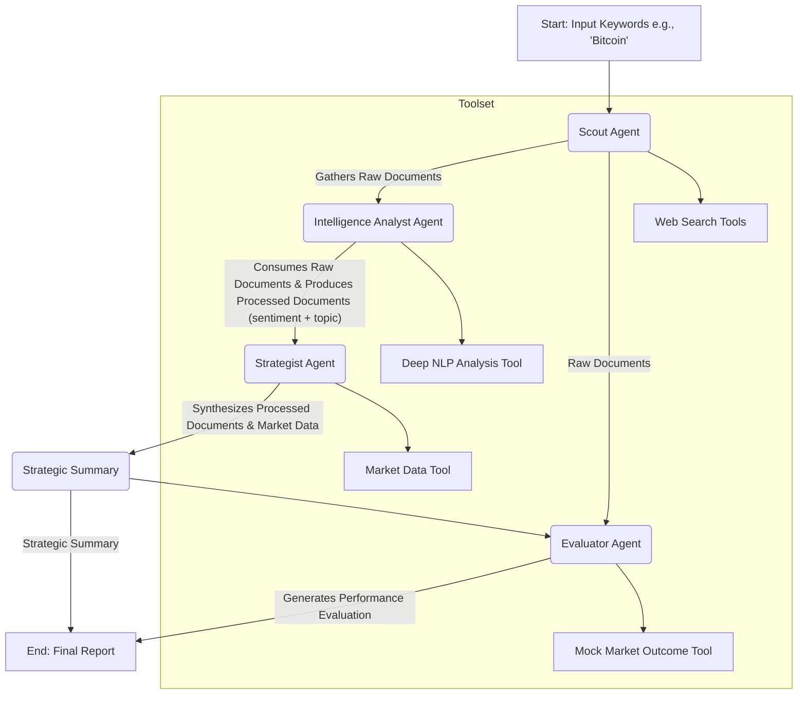

---

# CryptoSentinator 🤖📈

**A Production-Ready Multi-Agent System for Intelligent Market Sentiment Analysis**


An advanced multi-agent system that analyzes cryptocurrency sentiment with deep context.
Cryptosentinator uses a crew of specialized AI agents to gather data, perform nuanced NLP analysis, formulate strategic market hypotheses, and immediately evaluate its own performance.


## ✨ Live Demo

This project is deployed as an interactive Gradio application on Hugging Face Spaces. Try it live!

<a href="https://huggingface.co/spaces/manuelaschrittwieser/Cryptosentinator" target="_blank">
Try CryptoSentinator on Hugging Face Spaces
</a>
<br>


## 🚀 Key Features
 
-  🧠 **Multi-Agent Crew:** Employs four specialized agents (Scout, Analyst, Strategist, Evaluator) for a sophisticated division of labor.
-  📊 **Deep Contextual Analysis:** Moves beyond simple "positive/negative" scores by using **topic modeling** to understand *why* the sentiment exists.
-  📝 **Actionable Hypotheses:** The Strategist Agent delivers a clear, human-readable market hypothesis, not just raw data.
-  🔍 **Integrated Self-Evaluation:** A unique Evaluator Agent provides an immediate performance score on every run, creating a trust-building feedback loop.
-  ✅ **Production-Ready Design:** Built with containerization, robust error handling, and secure secrets management in mind. 

## 🛠️ System Architecture

The system operates as a sequential pipeline where each agent enhances the data, culminating in a self-evaluated, actionable report.



## ⚙️ Tech Stack

- **Orchestration:** LangChain & LangGraph
- **LLM Provider:** GeminiAI
- **UI Layer:** Gradio
- **Testing:** Pytest & Pytest-Mock
- **Containerization:** Docker (Optional)


## 🏁 Getting Started

Follow these instructions to set up and run the project locally.

### Prerequisites

-   Git
-   Python 3.9+
-   An Gemini API Key

### Installation & Setup

1.  **Clone the Repository**
    ```sh
    git clone <your-repository-url>
    cd cryptosentinator-v2
    ```

2.  **Set Up a Virtual Environment**
    It's highly recommended to use a virtual environment to manage dependencies.
   
    ```sh
    # For macOS/Linux
    python3 -m venv .venv
    source .venv/bin/activate

    # For Windows
    python -m venv .venv
    .\.venv\Scripts\activate
    ```

3.  **Install Dependencies**
    ```sh
    pip install -r requirements.txt
    ```

4.  **Configure Your API Key**
    Create a `.env` file in the root of the project directory. This file will store your secret API key.
    ```.env
     API_KEY="sk-YourSecret_ApiKey"
    ```
The application will automatically load this key. The .gitignore file is already configured to ignore .env files.

## 🚀 How to Run
### Run the Interactive UI

To launch the Gradio web interface, run the following command from the project root:
```sh
gradio app.py
```

Open the local URL provided (e.g., http://127.0.0.1:7860) in your browser.

### Run the Test Suite
To verify the integrity of all components, run the test suite:

```bash
pytest

```
or
```bash
PYTHONPATH=. pytest --maxfail=5 --disable-warnings -q

```

## 🧪 Testing, Validation, and Security

This repository contains a comprehensive test suite and follows best practices for security and error handling.

### Test Suite

The project uses pytest for testing. The test suite, located in the /tests directory, provides excellent coverage for all critical components.
- **Unit Tests:** Each agent's logic and each tool's functionality are tested in isolation.
- **Mocking:** All external API calls are mocked using pytest-mock, ensuring tests are fast, deterministic, and free to run.

# Input Validation & Error Handling

- **Input Validation:** The Gradio interface provides basic sanitization. The backend create_interactive_pipeline function also checks for empty or invalid user input and returns a user-friendly warning.
- **Resilience:** Critical pipeline steps are wrapped in try...except blocks. For example, if an NLP analysis fails, the system returns a neutral default value instead of crashing, ensuring the pipeline can complete.
- **User Feedback:** Clear error messages are displayed on the UI if a backend process fails, while detailed tracebacks are printed to the console for debugging.

### Security Precautions

- **Secrets Management:** API keys are never hardcoded. The application reads secrets from environment variables. For local development, this is managed via the .env file (which is git-ignored).
For deployment on platforms like Hugging Face Spaces, secrets are stored securely using the platform's built-in secrets manager.

## 📁 Project Structure

The codebase is organized to be modular and easy to navigate.

```
├── cryptosentinator/        # Main application package
│   ├── __init__.py
│   ├── agents/              # Contains the logic for each specialized agent
│   │   ├── __init__.py
│   │   ├── scout_agent.py
│   │   ├── intelligence_analyst_agent.py
│   │   └── ...
│   ├── tools/               # Contains tools used by agents (e.g., NLP, web search)
│   ├── graph_state.py       # Defines the shared state for the LangGraph workflow
│   ├── config.py            # Handles configuration and environment variables
│   └── main.py              # Original entry point for non-interactive runs
│
├── tests/                   # Test suite for the project
│   ├── __init__.py
│   ├── conftest.py          # Shared pytest fixtures (e.g., mock data)
│   ├── test_agents.py       # Unit tests for agents
│   └── test_tools.py        # Unit tests for tools
│   └──  # Expandable
├── .env.example             # Example environment file
├── .gitignore               # Specifies files to ignore in git
├── app.py                   # Entry point for the Gradio UI application
├── interactive_pipeline.py  # Core logic function for the Gradio app
├── Dockerfile               # For containerizing the application (Optional)
├── requirements.txt         # Project dependencies
└── README.md                # You are here!
```

## ☁️ Deployment
This application is designed for flexible deployment.

- **Hugging Face Spaces (Recommended for Demo):** The included app.py and requirements.txt are configured for immediate deployment. Simply connect your GitHub repository to a new Gradio Space.
- **Containerized Service (For Production):** Dockerfile allows you to build a container image for deployment on platforms like AWS Fargate, Google Cloud Run, or Render for automated, scheduled analysis tasks.


## 🤝 Contributing

Contributions are welcome! If you have suggestions for improvements or want to add new features, please follow these steps:

1. Fork the repository.
2. Create a new feature branch (git checkout -b feature/AmazingFeature).
3. Commit your changes (git commit -m 'Add some AmazingFeature').
4. Push to the branch (git push origin feature/AmazingFeature).
5. Open a Pull Request.

Please open an issue first to discuss what you would like to change.


## 📜 License

This project is licensed under the MIT License. See the LICENSE file for details.
